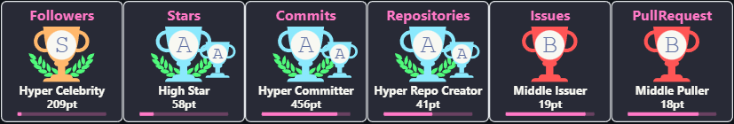



<h1 align="center">Hi I'm Ujjwal Sharma</h1>
<h3 align="center">An enthusiastic Full Stack Web Developer, a lifelong learner, skilled in both front-end and back-end. High adaptability to learn new technologies quickly and pay attention to details. Aims to leverage knowledge and build world-class websites while facilitating organization in achieving functional goals.</h3>

 

<h3 align="center" color:"red">
     
      </h3>
      
      

- 🔭 I’m currently working on **Node**

- 🤝 I’m looking for help with **collaborative project**

- 👨‍💻 All of my projects are available at [https://ujjwal1309.github.io/](https://ujjwal1309.github.io/)

- 💬 Ask me about **JavaScript, Node and MongoDB**

- 📫 How to reach me **ujjwalsharma1309@gmail.com**

- ⚡ Fun fact **I think I can beat Magnus Carlsen in chess**

<h3 align="left">Connect with me:</h3>

<h3 align="left">Languages and Tools:</h3>

    

  

 

